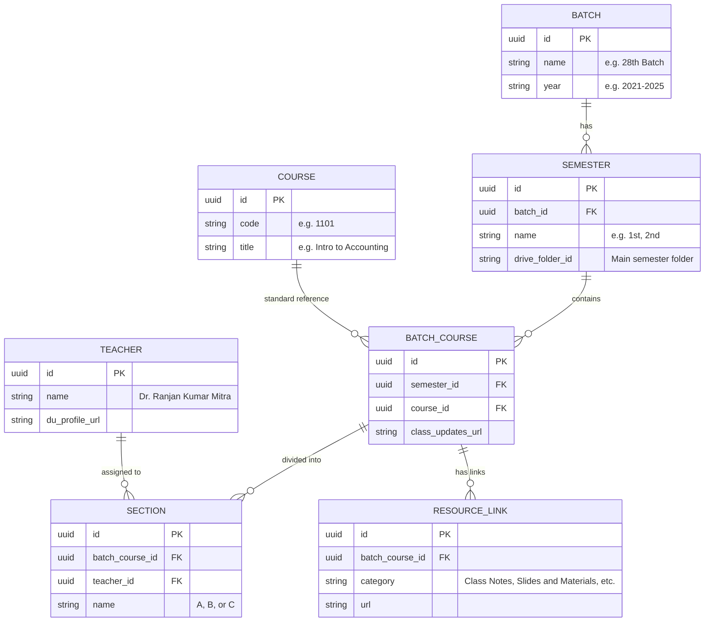

# Pivot: Dynamic Academic Resort (Next.js + Supabase)

To achieve your vision of a site managed by batch representatives, we will move from a static site to a **dynamic web application** using **Next.js** and **Supabase**.

## Why Supabase Storage is Enough

> [!NOTE]
> **Database (500MB)**: Your current site data (all 8 batches) is less than **0.5MB** in total. Even when expanded into a database, it will likely be under **5MB**. You have 100x more space than you need for the "text" part of the site.
>
> **Files (1GB)**: Since your PDFs and slides are stored on **Google Drive**, Supabase only stores the "links" (text). You won't be uploading actual files to Supabase, so you'll never hit that limit.

## Detailed Database Schema

The goal of this schema is to move the "spaghetti" of the JSON files into organized tables that a UI can easily update.

### Explanation of the Tables:
1.  **`BATCH` & `SEMESTER`**: These hold the high-level organization (like your folders).
2.  **`COURSE`**: These are the *permanent* subjects (Accounting 1101). We store them once so you don't have to keep re-typing the names for every new batch.
3.  **`TEACHER` [NEW]**: A global directory of all faculty members. Reps select from this list rather than typing names manually.
4.  **`BATCH_COURSE`**: This is the "Specific Instance". It says: "In the 28th Batch's 1st Semester, we are taking Accounting 1101."
5.  **`SECTION`**: Attached to that specific instance. Restricted to **Sections A, B, and C** only, and linked to a `TEACHER`.
6.  **`RESOURCE_LINK`**: This replaces the `links` arrays in your JSON. We will use a **fixed set of categories** to keep the search filters and UI predictable:
    *   `Class Notes`
    *   `Slides and Materials`
    *   `Books and Manuals`
    *   `Question Bank` (singlular "Bank" is more standard for a repository).

## 💡 Clever Ideas for Easy Use

### 1. UI/UX "Premium" Experience
*   **Command Palette (Quick Nav)**: Press `Ctrl + K` to open a global search overlay. Users can type "28th 4th" to jump straight to that batch/semester.
*   **Skeleton Loading**: Instead of a "Loading..." text, show shimmering grey bars that match the layout for a very smooth fee.
*   **Automatic Dark Mode**: Detect system preferences to toggle between a sleek Dark Mode and the clean light theme.

### 2. Representative Automation
*   **Link Health Monitor**: A background script (running as a Vercel Cron job) that checks all Google Drive links once a week and alerts reps if a link becomes broken (404). This is more scalable than third-party monitors for thousands of individual file links.
*   **Smart Link Import**: Reps can simply paste a list of URLs. The system will:
    1.  Automatically detect if it's a Slide, Book, or Note.
    2.  Show a **Verification Grid** where the rep can double-check the titles and categories.
    3.  Click "Confirm & Save" to batch-upload all links at once.

### 3. Database Optimization
*   **Full-Text Search (PGSearch)**: Use PostgreSQL's internal search engine to make searching for "Accnt" find "Accounting" instantly, even if spelled slightly wrong.

### Scaling and "Row Count" Reassurance

> [!TIP]
> **Is 40 rows per batch too many?**
> Not at all! In database terms, 40 rows or even 400 rows is extremely small.
> - **Wait, won't it get huge?**: If you have 10 batches, you'll have **400 rows** in the `BATCH_COURSE` table.
> - **The Reality**: Supabase (PostgreSQL) handles **millions** of rows without breaking a sweat. 400 rows is like a single drop of water in a bucket. 
> - **The Benefit**: Having one row per course-batch allows the search system to be lightning fast and allows specific teachers to be assigned to specific years.

## The Vision: Manage via UI
1.  **Login**: A Representative logs in.
2.  **Auto-Filter**: The dashboard automatically shows them only their Batch/Semester.
3.  **The Form**: Instead of JSON code, they see a simple table:
    *   **Section A Teacher**: [ Input Box ]
    *   **Add "Notes" Link**: [ URL Input Box ]
    *   [ Save Button ]

## Proposed Changes

### Component 1: Next.js Framework
Migrate existing design and search/filtering logic.

### Component 2: Supabase Setup
Initialize the tables above and set up Auth for campus emails (if desired).

### Component 3: Data Migration
A script to automatically populate these tables from your existing `batches/batch-*.json` files.

## Verification Plan

### Automated Tests
### Manual Verification
1.  **Representative Flow**: Log in as a rep, add a drive link via UI, and see it instantly appear on the public site.
2.  **Migration Check**: Verify all 50+ courses from previous JSONs are successfully imported into Supabase.
